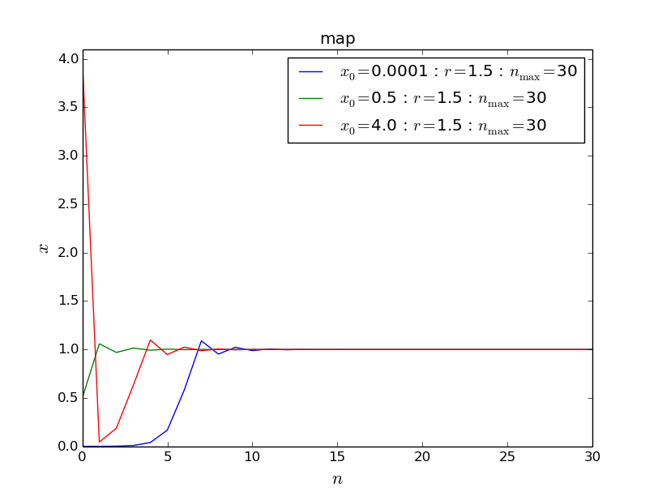
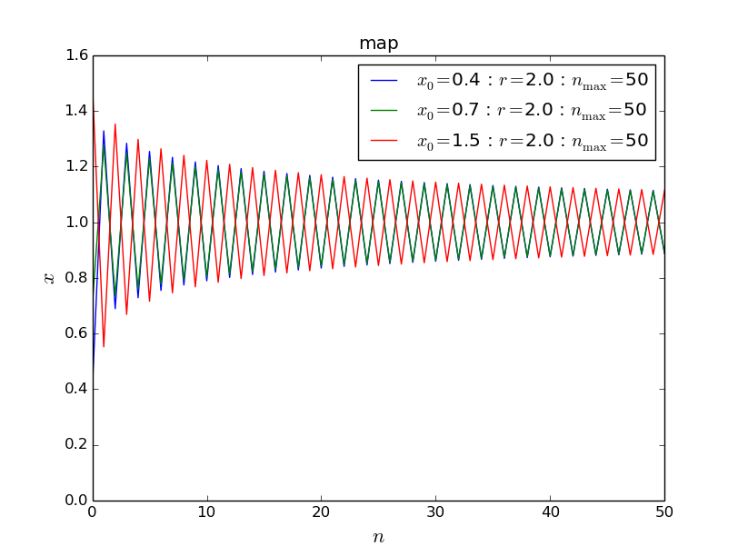
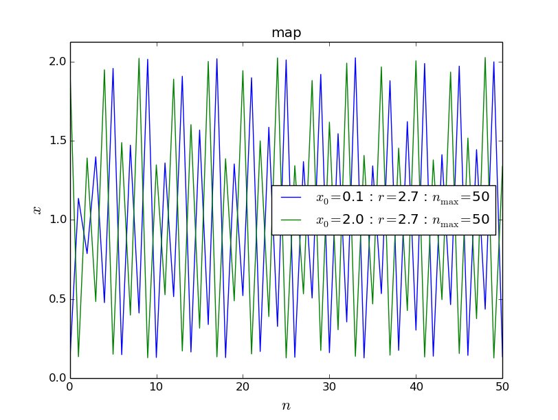
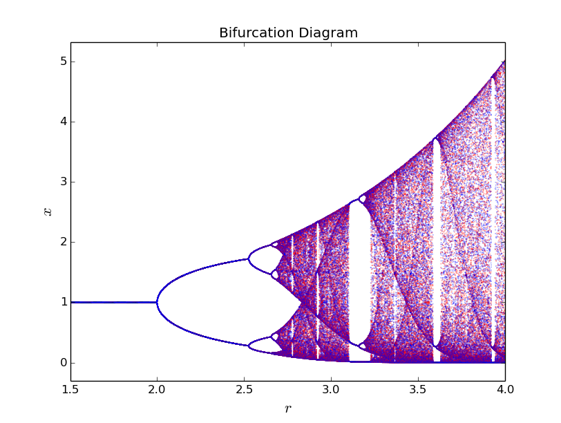
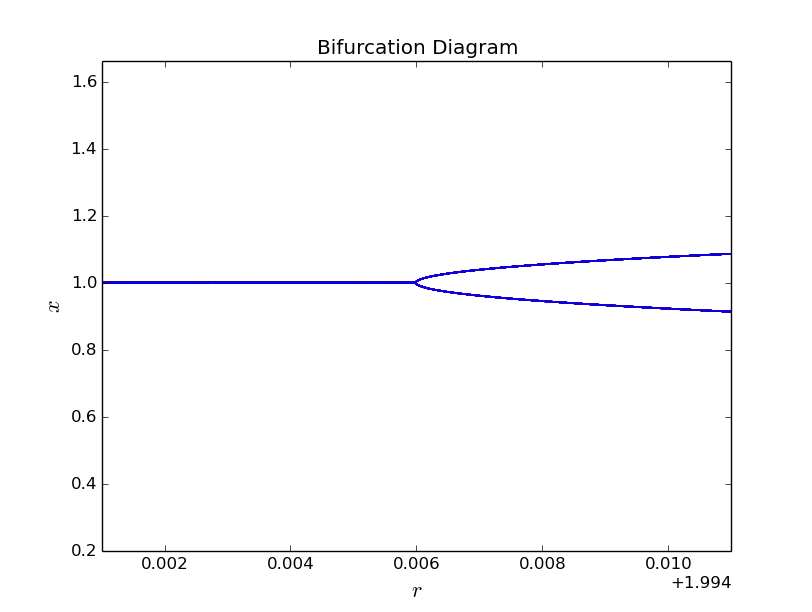
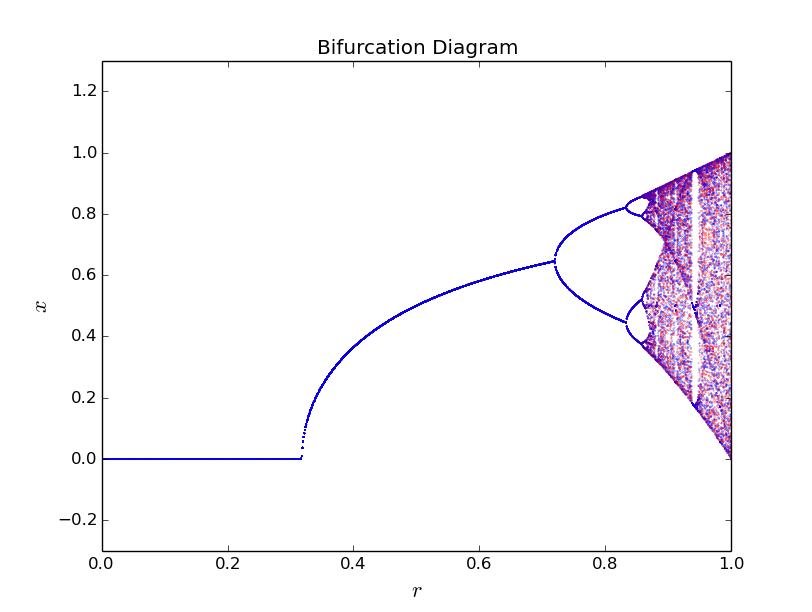

.. _6-8-label:

===============================================================================
問題6.8 - 他の1次元写像
===============================================================================

.. contents::

シミュレーションの目的
============================

このシミュレーションの目的は、1次元写像

.. math:: f(x)=xe^{r(1-x)}
    :label: e1

.. math:: f(x)=r\sin{\pi x}
    :label: e2

の定性的な性質を調べることである。写像\ :eq:`e1`\ は、伝染病の影響で個体数に上限のある生態系モデルの研究のために、生態学者たちに用いられた。これは、\ :ref:`問題6.1 <6-1-label>`\ で考えた写像

.. math:: f(x)=4rx(1-x)
    :label: e3

よりもさらに複雑であるが、初期の個体数にどんな正の値を用いても、その個体数が正になることが好都合な点である。\ :math:`r`\ の最大値には制限はないが、\ :math:`r`\ が十分に大きくなると、\ :math:`x`\ は実質的に0になり、その生物は絶滅してしまう。\ :math:`0 < r \le 1`\ および\ :math:`0 \le x \le 1`\ とした正弦関数による写像\ :eq:`e2`\ は、非線形である以外には特別なことはない。

作成したプログラム
=============================
本シミュレーションでは、\ :ref:`問題6.1 <6-1-label>`\ や\ :ref:`問題6.2 <6-2-label>`\ で行ったように、異なる初期値\ :math:`x_{0}`\ に対して時系列の発展の様子はどうなるか、また、十分時間の経過した後の\ :math:`x`\ の振る舞いは、\ :math:`r`\ によってどのように変化するか、ということをシミュレーションする。したがって問題6.1と問題6.2のプログラムの時間発展方程式の部分を書き換えるだけでよく、これらをパッケージ化したものを利用して、実行プログラムの中では関数の定義とパラメータの代入のみを行うように改良した。以下に作成したプログラムを列挙する。

* パラメータの設定ダイアログ( :download:`SetParameter.py <SetParameter.py>` )

.. literalinclude:: SetParameter.py
    :language: python
    :linenos:
    

* 与えられた関数とパラメータに関して時系列変化を描画するプログラム( :download:`myplot_6_8_iterate.py <myplot_6_8_iterate.py>` )

.. literalinclude:: myplot_6_8_iterate.py
    :language: python
    :linenos:
    

* 与えられた関数とパラメータに関してBifurcation Diagramを描画するプログラム( :download:`myplot_6_8_bifurcation.py <myplot_6_8_bifurcation.py>` )

.. literalinclude:: myplot_6_8_bifurcation.py
    :language: python
    :linenos:

* 式\ :eq:`e1`\ の時系列変化を描画するプログラム( :download:`6-8_example1.py <6-8_example1.py>` )

.. literalinclude:: 6-8_example1.py
    :language: python
    :linenos:

* 式\ :eq:`e1`\ のBifurcation Diagramを描画するプログラム( :download:`6-8_example1_bifurcation.py <6-8_example1_bifurcation.py>` )

.. literalinclude:: 6-8_example1_bifurcation.py
    :language: python
    :linenos:

* 式\ :eq:`e2`\ の時系列変化を描画するプログラム( :download:`6-8_example2.py <6-8_example2.py>` )

.. literalinclude:: 6-8_example2.py
    :language: python
    :linenos:

* 式\ :eq:`e2`\ のBifurcation Diagramを描画するプログラム( :download:`6-8_example2_bifurcation.py <6-8_example2_bifurcation.py>` )

.. literalinclude:: 6-8_example2_bifurcation.py
    :language: python
    :linenos:

実習課題
=====================

a. \ :math:`r=1.5, 2, 2.7`\ のとき、式\ :eq:`e1`\ の時系列はどのような振る舞いを示すか。\ :math:`f(x)`\ の定性的な振る舞いについて述べよ。極大点は存在するか。(補充課題)式\ :eq:`e2`\ の定性的な振る舞いについても調べる。

* まず、2.4のプログラムを用いて、\ :math:`r=1.5, 2, 2.7`\ としたときの式\ :eq:`e1`\ の時系列変化の様子を調べた。これらの実際のグラフを\ :num:`図#fig-6-8-f1`\ 、\ :num:`図#fig-6-8-f2`\ 、\ :num:`図#fig-6-8-f3`\ に示した。それぞれのグラフはいくつかの初期条件\ :math:`x_{0}`\ について調べてある。これらのグラフから分かることとして、\ :math:`r=1.5`\ のときアトラクタは\ :math:`x=1`\ であり、\ :math:`x>0`\ の任意の初期値に対して十分時間が経過すると周期1の運動となる。\ :math:`r=2.0`\ の時には、系は\ :math:`x=1`\ に周期2で振動しながら近づいていくことがわかる。\ :math:`r=2.7`\ の時には周期8より大きい周期で振動しており、カオス的な振る舞いを見せることが分かる。

.. _fig-6-8-f1:

    
    \ :math:`r = 1.5`\ で\ :math:`x_{0} = 0.0001, 0.5, 4.0`\ とした時のグラフ

.. _fig-6-8-f2:

    
    \ :math:`r = 2.0`\ で\ :math:`x_{0} = 0.4, 0.7, 1.5`\ とした時のグラフ

.. _fig-6-8-f3:

    
    \ :math:`r=2.7`\ で\ :math:`x_{0} = 0.1, 2.0`\ とした時のグラフ
    
    

次に、適当な初期値\ :math:`x_{0}`\ のもとで、十分時間が経過した後の\ :math:`x`\ の値を\ :math:`r`\ に関してプロットし、\ :math:`x`\ と制御パラメータ\ :math:`r`\ の定性的な関係について考える。\ :math:`x_{0}=0.5`\ 、\ :math:`r`\ の刻み幅\ :math:`dr=0.001`\ として、はじめの1000回の計算結果は無視し、その後の50回を赤、さらにその後の50回を青でプロットしたものを\ :num:`図#fig-6-8-f4`\ に示す。このグラフから、先ほど考慮した時間発展についてさらに多くの示唆が与えられる。例えば\ :math:`r=2.0`\ のとき、\ :num:`図#fig-6-8-f2`\ からだけでは、十分時間の経過した後に\ :math:`x`\ は1に収束するのか、それとも周期2で振動するのかがわからないが、\ :num:`図#fig-6-8-f4`\ を見ると、\ :math:`r=2.0`\ の付近で周期1から周期2への周期倍化が起こっていることが見て取れる。分岐点の位置を詳細に知るために、\ :math:`r=2.0`\ の部分を拡大し、さらに演算回数を増やしてみると(ntransient=1000000)、ちょうど\ :math:`r=2.0`\ で分岐することが分かる(\ :num:`図#fig-6-8-f4-2`\ )。

.. _fig-6-8-f4:

    
    式\ :eq:`e1`\ におけるパラメータ\ :math:`r`\ と\ :math:`x`\ の関係

.. _fig-6-8-f4-2:

    
    \ :math:`r = 2.0`\ の近傍での\ :math:`x`\ の振る舞い( :math:`\mathrm{dr} = 0.00001`)

* 式\ :eq:`e2`\ のBifurcation-Diagramを\ :num:`図#fig-6-8-f5`\ に示す。ここで初期値\ :math:`x_{0}=0.5`\ 、プロットしない演算回数\ :math:`\mathrm{ntransient}=1000`\ 、プロットする回数\ :math:`\mathrm{nplot}=50`\ 、\ :math:`r`\ の刻み幅\ :math:`\mathrm{dr}=0.001`\ とした。このグラフから、\ :math:`r=0.32`\ 付近で挙動が変化し(\ :math:`1<x_{0} \le 2`\ のときはちょうど\ :math:`x=0`\ で折り返した形)、\ :math:`r=0.71`\ で周期が2に変化している。次に\ :math:`r=0.83`\ のあたりでさらに周期が4に変化し、\ :math:`r=0.86`\ で周期8となって、その後すぐ周期16となっている。このように周期倍化の様子が観察され、以降の挙動はカオス的であることもわかる。\ :math:`r=0.94`\ 付近での周期3となる窓など、いくつかの窓があることも観察される。

.. _fig-6-8-f5:

    
    \ :math:`r`\ に対する過渡現象以後の\ :math:`x`\ の振る舞い

まとめ
=======================

1次元写像\ :eq:`e1`\ 、\ :eq:`e2`\ の定性的な振る舞いについて調べることを通して、ロジスティック写像以外の1次元写像におけるカオス的挙動と、そこに至るまでの周期倍化などについて理解を得ることができた。分岐点の位置\ :math:`r`\ から\ :math:`\delta`\ を算出する問題については、今後取り組むことにしたい。

参考文献
============================

* ハーベイ・ゴールド,ジャン・トボチニク,石川正勝・宮島佐介訳『計算物理学入門』,ピアソン・エデュケーション, 2000.

